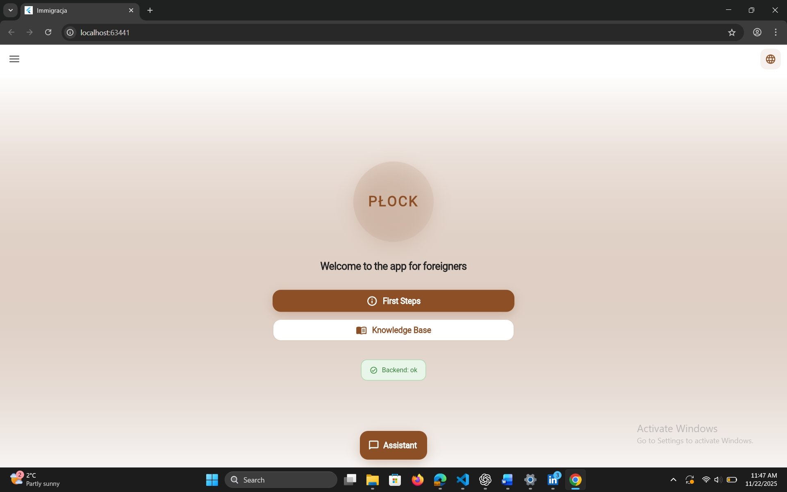
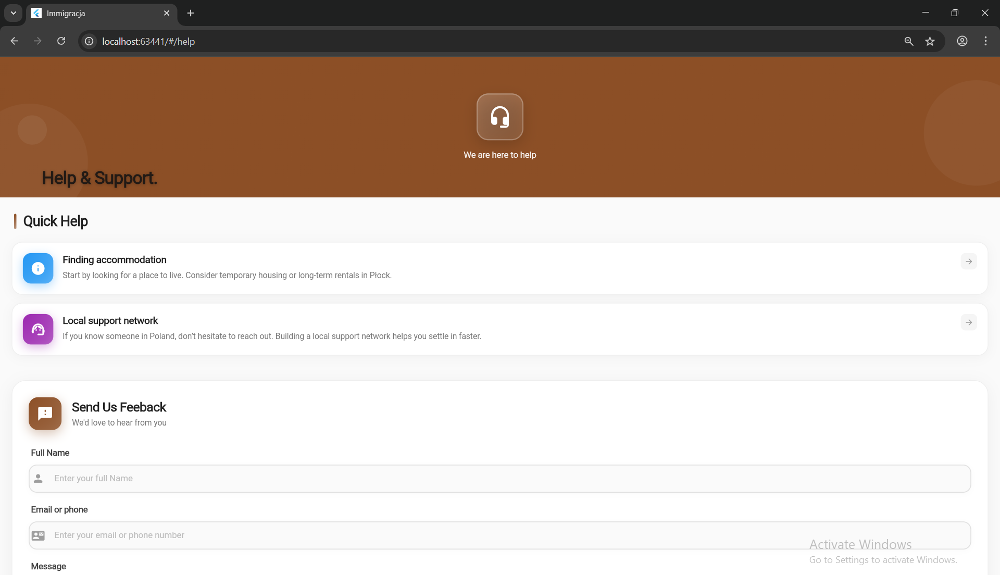
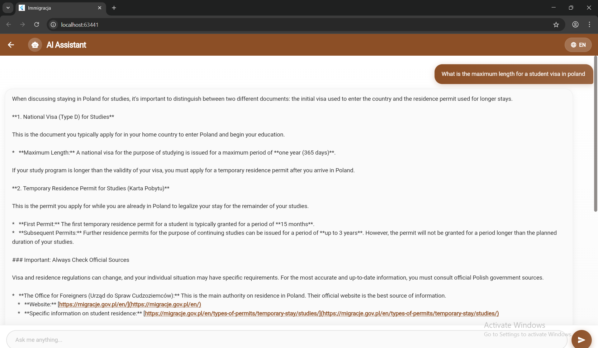
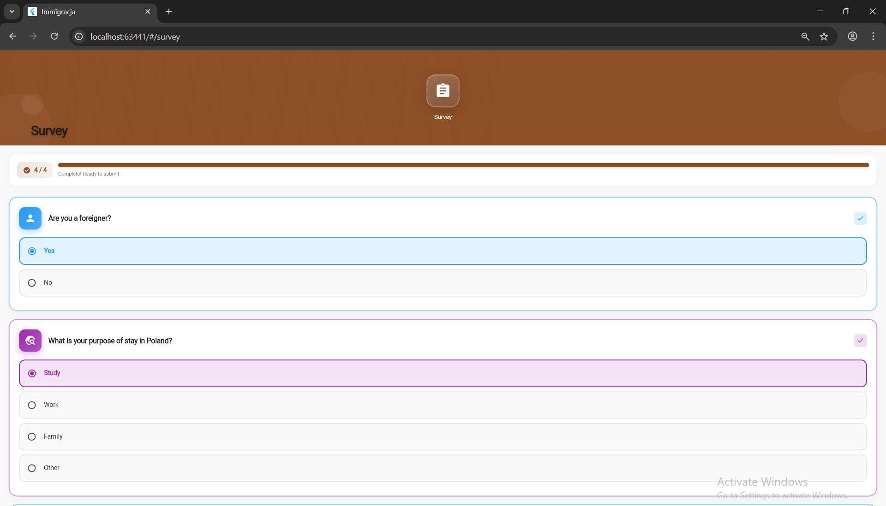

# PLOCK IMIGRACJA — Full System Documentation

This documentation covers the **architecture, design, logic, purpose, and technical structure** of the Plock Imigracja mobile application.  
It includes both **backend and frontend** explanations, screenshots placeholders, diagrams, problems solved, and system flows.


# Table of Contents
1. [Overview](#overview)

2. [Problem Statement](#problem-statement)

3. [Target Users](#target-users)

4. [Core Value Proposition](#core-value-proposition)

5. [Application Screenshots](#application-screenshots)

6. [System Architecture](#system-architecture)

7. [Architecture Diagram](#architecture-diagram)

8. [Frontend (Flutter) Documentation](#frontend-flutter-documentation)

9. [Backend (FastAPI) Documentation](#backend-fastapi-documentation)

10. [Database Structure](#database-structure)

11. [AI Assistant Logic](#ai-assistant-logic)

12. [Translation System](#translation-system)

13. [API Endpoints Overview](#api-endpoints-overview)

14. [Security Considerations](#security-considerations)

15. [Future Improvements](#future-improvements)

16. [Appendix: Resources & Images](#appendix-resources--images)

---

# Overview

**Plock Imigracja** is a multilingual mobile application designed to help foreigners navigate essential processes in Poland, including:

- immigration procedures  

- education  

- healthcare  

- housing  

- legal documentation  

- cultural adaptation  

The application provides:

- **dynamic localized content**  

- **AI-powered Q&A assistant** (Gemini 2.5)  

- **multilingual knowledge base**  

- **help & support resources**  

- **survey & feedback collection**  

The system is built using:

- **Flutter** (frontend)

- **FastAPI** (backend)

- **SQLite** (development DB)

- **PostgreSQL** (production DB)

- **Google Vertex AI — Gemini 2.5** (AI engine)

- **SQLAlchemy ORM** (database layer)

---

# Problem Statement

Foreigners arriving in Poland face several challenges:

- Lack of **centralized and localized information**

- Language barriers (PL, EN, UK, RU)

- Difficulty navigating legal processes

- No unified platform for accessing immigration knowledge

- Scattered or outdated online resources

- Limited access to guidance for newcomers

According to  migration statistics:

- Over **3 million foreigners** reside in Poland (as of 2024)

- Over **500,000 Ukrainians** arrived in the past 2 years

- Over **200,000 students** come from abroad annually

**The Plock Imigracja application centralizes this information into one accessible platform.**

---

# Target Users


- International students  

- Foreign workers  

- Refugees  

- Newcomers to Poland  

- English / Ukrainian / Russian speakers  

- Anyone needing immigration or city guidance  

---

# Core Value Proposition


- **One source of truth** for verified immigration content  

- **Automatic translations** stored and reused (no repeated AI costs)  

- **AI assistant** provides tailored multilingual answers  

- **User-friendly UI** built for non-technical immigrants  

- **Mobile-first experience** for everyday use  

- **Fast, lightweight**, and offline-safe UI components  

---

# Application Screenshots












---

# System Architecture

The project uses a **service-oriented architecture (SOA)** with separation of concerns:


- **Flutter Frontend**  

- **FastAPI Backend**  

- **AI Service Layer (Gemini 2.5)**  

- **Translation Engine + Caching**  


- **SQLite/PostgreSQL Database**  

- **REST API Layer**  

- **Content Management Layer**  

---

# Architecture Diagram

(Replace this placeholder with your diagram)

```

```

Or recreate using draw.io or Whimsical.

---

# Frontend (Flutter) Documentation

## Technology Stack

- Flutter 3.x

- Dart

- HTTP client

- Provider / ValueNotifier locale state

- Clean navigation structure

- Material 3 / Custom theming

## Folder Structure
```
imigracja_frontend/
├─ apps/
│  ├─ ios/
│  ├─ android/
│  ├─ linux/
│  ├─ test/
│  │  └─ widget_test.dart
│  ├─ lib/
│  │  ├─ chat_ai/
│  │  │  └─ chat_screen.dart
│  │  ├─ features/
│  │  │  ├─ categories/
│  │  │  │  └─ categories_screen.dart
│  │  │  ├─ help/
│  │  │  │  └─ help_screen.dart
│  │  │  ├─ knowledge_base/
│  │  │  │  └─ knowledge_base_screen.dart
│  │  │  ├─ onboarding/
│  │  │  │  └─ onboarding_screen.dart
│  │  │  ├─ survey/
│  │  │  │  └─ survey_screen.dart
│  │  ├─ services/
│  │  │  └─ api_services.dart
│  │  ├─ app.dart
│  │  └─ main.dart
│  ├─ README.md
│  └─ pubspec.yaml
```

## Key Features

- Fetches multilingual texts dynamically  

- Displays knowledge base content  

- Integrates AI chat assistant  

- Sends feedback + survey responses  

- Manages locale state in real-time  

---

# Backend (FastAPI) Documentation

## Core Responsibilities

- Content delivery  

- Translation caching  

- Database ORM operations  

- AI question answering  

- Input validation (Pydantic)  

- Rate limiting (SlowAPI)  

- CORS configuration  

- JSON responses for mobile frontend  

## Key Routes
```
/content
/v1/ai/ask
/feedback
/survey
/welcome
```

---

# Database Structure

Tables include:

- **content** — base English content  

- **translations** — cached translations  

- **feedback** — user feedback submissions  

- **survey_answers** — stored survey responses  

- **ai_logs** — AI assistant request metadata  

Example SQLAlchemy model placeholder:

```
class Content(Base):
    __tablename__ = "content"
    id = Column(Integer, primary_key=True)
    category = Column(String)
    lang = Column(String)
    title = Column(String)
    body = Column(Text)
```

---

# AI Assistant Logic

Gemini 2.5 is used with:


- Query classification  

- Prompt building  

- Safety enforcement  

- Language enforcement  

- Context injection  

- Structured response generation  

Flow:

1. Flutter sends `{ query, target_lang }`

2. FastAPI validates

3. Classifier determines the topic

4. Prompt builder formats a safe prompt

5. Gemini 2.5 generates output

6. Backend returns structured JSON

---

# Translation System

Flow:
1. English base content stored in DB

2. User requests: `/content?lang=pl`

3. If translation exists → return it

4. If not:

   - Translate via Translator AI

   - Store in DB

   - Return instantly

This creates an **auto-growing multilingual CMS**.

---

# API Endpoints Overview

### Get Content
```
GET /content?category={category}&lang={lang}
```

### Ask AI Assistant
```
POST /v1/ai/ask
```

### Submit Feedback
```
POST /feedback
```

### Submit Survey Answers
```
POST /survey
```

---

# Security Considerations
- No API keys exposed in Flutter  

- Backend uses service account for Gemini  

- CORS restricted to mobile app  

- SlowAPI rate limiting on AI routes  

- Input validation prevents malformed requests  

---

# Future Improvements
- Full deployment to Google Cloud Run  

- Replace SQLite → PostgreSQL  

- Implement authentication (JWT)  

- Add SMS/email verification  

- Improve analytics dashboard  

- Add offline mode in Flutter  

- Integrate Push Notifications  

---

# Appendix: Resources & Images

Place all images inside:

```
docs/images/
```

Diagrams inside:

```
docs/diagrams/
```

Example embed:

```

```

---

# END OF DOCUMENTATION
